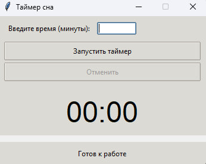
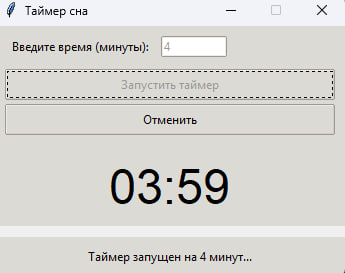

# ⏰ Sleep Timer – умный таймер сна с автовыключением ПК

[](https://www.microsoft.com/windows)
[](https://python.org)
[](LICENSE)

**Sleep Timer** – это легковесное приложение с графическим интерфейсом, которое помогает засыпать под видео или музыку, автоматически выключая компьютер после заданного времени. Программа проверяет активность пользователя, чтобы случайно не прервать просмотр, и даёт возможность продлить таймер при необходимости.

---

## 📋 Содержание

- [🔥 Основные возможности](#-основные-возможности)
- [📸 Интерфейс](#-интерфейс)
- [⚙️ Как это работает](#️-как-это-работает)
- [💻 Требования](#-требования)
- [🚀 Установка и запуск](#-установка-и-запуск)
- [📦 Компиляция в .exe](#-компиляция-в-exe)
- [📁 Структура проекта](#-структура-проекта)
- [🔧 Устранение неполадок](#-устранение-неполадок)
- [📝 Логирование](#-логирование)
- [📜 Лицензия](#-лицензия)

---

## 🔥 Основные возможности

| Функция | Описание |
|--------|----------|
| 🕒 **Таймер в минутах** | Простое поле ввода, поддерживаются целые положительные числа. |
| ⏳ **Визуальный обратный отсчёт** | Крупный дисплей формата `MM:SS`, обновляющийся каждую секунду. |
| 👀 **Проверка активности** | Отслеживание движений мыши и нажатий клавиш в окне программы. |
| 💤 **Автоматическое выключение** | Если за 30 секунд после окончания таймера не зафиксирована активность, выполняется `shutdown /s /t 30`. |
| ❓ **Интеллектуальный диалог** | При обнаружении активности открывается окно с выбором: **Да** (повторить таймер), **Нет** (задать новое время), **Отмена** (сброс). При бездействии в диалоге в течение 30 секунд компьютер также выключается. |
| 🔒 **Автозапрос прав администратора** | При запуске программа проверяет наличие административных привилегий и при необходимости перезапускает себя с повышением через UAC. |
| 📝 **Ведение лога** | Все ключевые события записываются в `sleep_timer.log`, что упрощает диагностику. |

---

## 📸 Интерфейс

> *Скриншоты интерфейса можно добавить в папку `screenshots` и вставить сюда ссылки.*

Главное окно программы:



Диалоговое окно при обнаружении активности:



---

## ⚙️ Как это работает

1. Пользователь задаёт количество минут и запускает таймер.
2. Начинается обратный отсчёт, время отображается на экране.
3. По истечении основного времени запускается **30-секундная проверка бездействия**.
   - Если в течение этого времени **не зафиксировано** движений мыши или нажатий клавиш – компьютер выключается.
   - Если активность **обнаружена** – открывается диалоговое окно с тремя вариантами.
4. В диалоге также действует **30-секундный таймер**. Если пользователь не сделал выбор, происходит выключение.
5. Выключение выполняется командой `shutdown /s /t 30` (с задержкой 30 секунд, чтобы можно было отменить через `Win+R → shutdown /a`).

---

## 💻 Требования

- **ОС**: Windows 7 / 8 / 10 / 11 (работа проверена на Windows 10 и 11)
- **Python**: 3.6 или новее (только для запуска исходного кода)
- Для скомпилированного `.exe` дополнительное ПО не требуется.

---

## 🚀 Установка и запуск

### Запуск Python-скрипта

1. Склонируйте репозиторий или скачайте архив.
2. Откройте терминал в папке с файлом `sleep_timer.py`.
3. Выполните:
   ```bash
   python sleep_timer.py